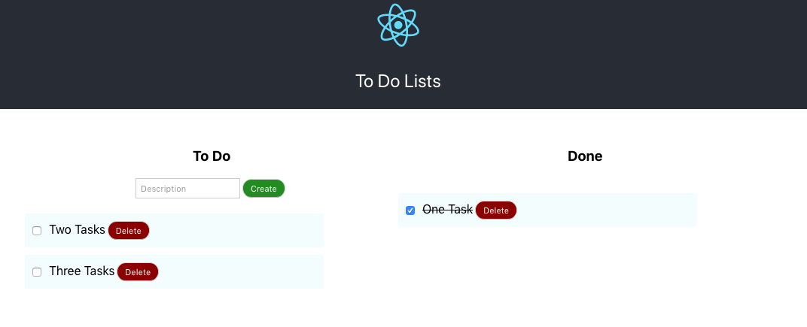

# To Do List with React

Criação de um aplicativo de lista de tarefas off-line com LocalStorage. Neste aplicativo, poderá 
adicionar e remover tarefas, bem como marcá-las como concluídas. 

Esta aplicação foi desenvolvida baseado no Nanodegree da Udacity.

